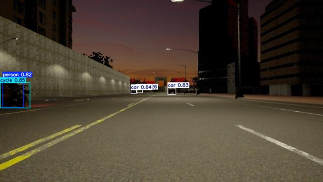
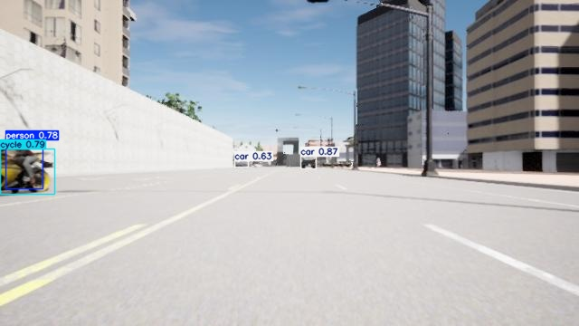

# 使用 Carla 生成 YOLOv5 訓練資料集工具 | Carla YOLOv5 Dataset Generator  

## 專案簡介 | Project Description

本專案使用 [CARLA Simulator](https://carla.org/) 搭配自訂感測器腳本，自動生成同個場景不同天氣且可用於 YOLOv5 訓練的資料集。  
This project uses the [CARLA Simulator](https://carla.org/) along with custom sensor scripts to automatically generate datasets for YOLOv5 training, with the same scene under different weather conditions.  


---

## 開始使用 | Getting Started

本專案提供兩種開始使用的方式，請選擇適合您的方法：

### 方式一 | Option 1  

- 請依照 **步驟一** 至 **步驟七** 的指示手動執行每個步驟，這樣可以讓您更了解每個步驟的過程與操作。  
  Please follow the instructions from **Step 1** to **Step 7** and execute each step manually. This will help you better understand the process and operations involved in each step. 

### 方式二 | Option 2  

- 使用 `shellscript/generate_in_screen.sh` 腳本（參考 `shellscript/example.txt`），這個腳本會自動完成 **步驟一** 和 **步驟二** 的操作。，請自行執行 **步驟三** 至 **步驟七** 。  
  Use the `shellscript/generate_in_screen.sh` script (refer to `shellscript/example.txt`), which will automatically complete **Step 1** and **Step 2**. Please manually execute **Step 3** to **Step 7** afterward.  

  **請注意 | Note**  
  - 這邊的 **步驟一** 是使用 Docker 來啟動 Carla Server，請確保您的環境已經正確配置好 Docker。  
    In this method, **Step 1** uses Docker to launch the Carla Server. Please ensure that Docker is properly set up in your environment.   
  - 在執行 **步驟二** 的腳本時，可能會遇到客戶端連接至 Carla server 超時的問題，這屬於正常現象，請耐心等待，不要自行停止。  
    While executing the script in **Step 2**, you may encounter timeout issues when the client connects to the Carla Server. This is expected behavior—please be patient and do not stop the script manually.
  
---
  
## 步驟一: 啟動Carla Server | Step 1: Launch Carla Server
- **注意事項 | Note**  
  本專案是使用 VNC 遠端連線至無頭伺服器（headless server）上操作，並啟動 Carla Server。  
  This project is designed to run on a headless server via VNC remote connection, where the Carla Server is launched remotely.

  Carla Server 啟動與操作教學請參考以下連結  
  For detailed instructions on launching Carla Server on a remote headless server, refer to the guide below

  🔗 [使用 TightVNC Viewer 遠端連線 Ubuntu 無頭伺服器並啟動 Carla](https://i-m-kj.blogspot.com/2024/12/windows-ubuntu-tightvnc-viewer-remote.html)

## 步驟二：產生原始資料 | Step 2: Generate Raw Data

### `generate_raw_data.py`

- **用途說明 | Purpose**  
  利用 Carla 模擬器啟動一台車輛，掛載三種感測器（RGB 相機、雷達、Instance Segmentation 相機）以收集原始訓練資料。  
  This script uses the Carla simulator to spawn a vehicle and attach three sensors: an RGB camera, a radar, and an instance segmentation camera, to collect raw data for training.  

- **參數 | Parameters**
  #### `--rawdata-path`
  **描述**: 存放原始資料的路徑。  
  **Description**: Path to store the raw data.  
  **Example**: `--rawdata-path /path/to/rawdata`

  #### `-w`
  **描述**: 行人數量。  
  **Description**: Number of pedestrians.  
  **Example**: `-w 10`  

  #### `-n`
  **描述**: 車子數量。  
  **Description**: Number of cars.  
  **Example**: `-n 20`  

  #### `--radar`
  **描述**: 雷達的參數。  
  **Description**: Parameters for the radar.  
  **Example**: `--radar 90.0 50000 80 0 25`  

  #### `--interval`
  **描述**: 收集資料的頻率（秒）。  
  **Description**: Frequency (in seconds) for collecting data.  
  **Example**: `--interval 60`  

  #### `--projectionflag`
  **描述**: 及時顯示雷達點投影至相機的開關。  
  **Description**: Switch to display radar points projected onto the camera in real-time.  
  **Example**: `--projectionflag True`  

  #### `--port`
  **描述**: CARLA server 的端口。  
  **Description**: Port for the CARLA server.  
  **Example**: `--port 3000`  

  #### `--res`
  **描述**: 視窗解析度。  
  **Description**: Resolution of the window.  
  **Example**: `--res 1920x1080`  

  ---
  有興趣的朋友可以參考 [CARLA 官方文檔](https://carla.readthedocs.io/en/latest/)  

  If you're interested, you can refer to the [CARLA Official Documentation](https://carla.readthedocs.io/en/latest/).  


---

## 步驟三：處理雷達與相機資料 | Step 3: Process Radar and Camera Data

本專案是為了 **相機與雷達融合（Fusion: Camera + Radar）** 而設計，因此會使用雷達點資料，並產生下列多通道格式的影像：
This project is designed for **sensor fusion (camera + radar)**. It utilizes radar point data and generates multi-channel image formats as follows:

- `(R, G, B)`
- `(R, G, B, radar_detect)`
- `(R, G, B, radar_detect, radar_depth)`
- `(R, G, B, radar_detect, radar_depth, radar_pos_velocity, radar_neg_velocity)`

---

### `rawdata_to_cleandata.py`  

- **用途說明 | Purpose**  

  過濾掉不在物件上的雷達點。
  結合 instance segmentation camera 的資訊，為影像加上標註。
  最終在 `cleandata/` 資料夾下產生：
    - `camera/`, `radar/`
    - `labels-3/`, `labels-4/`, `labels-5/`, `labels-7/`
    - 並於 `check_data_bboxNradar/bboxNradar/` 中產生對應可視化結果。

  Filters out radar points not located on objects.
  Uses the instance segmentation camera to label the images.
  Produces output in the `cleandata/` directory:
    - `camera/`, `radar/`
    - `labels-3/`, `labels-4/`, `labels-5/`, `labels-7/`
    - Visualization results stored under `check_data_bboxNradar/bboxNradar/`

- **參數 | Parameters**  
  可使用 `--read-parent-dir` 參數指定要讀取的原始資料夾位置，透過 `--write-parent-dir` 指定輸出的目錄位置，並可透過 `--check-parent-dir` 指定輸出Bboximg的目錄位置。
  Use the `--read-parent-dir` argument to specify the source directory, the `--write-parent-dir` argument to specify the target output directory, and the `--check-parent-dir` argument to specify the output directory for Bbox images.

---

### 若只使用 RGB 圖像 | If Using RGB-Only Images  

若你只需要使用 RGB 圖像來訓練模型，可修改程式碼，並在 `config/file.py` 中設定  
If you only want to use RGB images for object detection, you can modify the code and set the following in `config/file.py`  

```python
CHANNELS = [3]
```

## 步驟四：生成 YOLOv5 訓練資料 | Step 4: Generate YOLOv5 Training Data

### `cleandata_to_sourcedata.py`
  
- **用途說明 | Purpose**  
  此腳本會使用 `cleandata/` 資料夾中的 `camera/` 與 `radar/`，生成 YOLOv5 所需的輸入訓練資料。輸出會分別存放在 `sourcedata/` 底下的 `3-channel/`、`4-channel/`、`5-channel/` 以及 `7-channel/` 資料夾中。此外，步驟三所產生的 `labels` 也會一併被移動至這些資料夾。  
  This script uses the `camera/` and `radar/` folders under `cleandata/` to generate input training data for YOLOv5. The output will be saved under `sourcedata/` in the subdirectories: `3-channel/`, `4-channel/`, `5-channel/`, and `7-channel/`. The `labels` generated from Step 3 will also be moved accordingly.

  ⚠️ **注意：若使用 4-channel、5-channel 或 7-channel，需要修改 YOLOv5 的模型結構以支援非 3-channel 的輸入。**  
  ⚠️ **Note: If you plan to use 4-channel, 5-channel, or 7-channel data, you must modify the YOLOv5 model to support non-3-channel inputs.**

- **參數 | Parameters**  
  可使用 `--read-parent-dir` 參數指定要讀取的原始資料夾位置，並可透過 `--write-parent-dir` 指定輸出的目錄位置。
  Use the `--read-parent-dir` argument to specify the source directory, and the `--write-parent-dir` argument to specify the target output directory. 


## 步驟五：建立資料集格式 | Step 4: Create Dataset Format  

### `convert_to_dataset.py`  

- **用途說明 | Purpose**  
  此腳本會使用 Linux 的 symbolic link 機制，且依照您指定的格式來創建出訓練用的資料集。  
  This script uses Linux's symbolic link mechanism to create training datasets based on the specified format.  

- **參數 | Parameters**  
  可使用 `--format` 參數指定輸出格式為 `"yolo"` 或 `"voc"`，並可透過 `--n` 參數設定資料集的總數量大小。
  Use the `--format` argument to specify the output format as `"yolo"` or `"voc"`, and the `--n` argument to define the total number of data samples.
  
## 步驟六:開始訓練 | Step 5: Start Training  

請先 Clone YOLOv5 原始碼，接著即可使用步驟五產生的訓練集進行訓練。  
First, clone the official YOLOv5 repository, then you can start training using the dataset generated in Step 5.

```bash
git clone https://github.com/ultralytics/yolov5

cd yolov5

pip install -r requirements.txt
```

然後使用以下命令開始訓練  
Then, use the following command to start training  

```bash
# 使用 3 通道圖像進行從頭訓練 | Train From Scratch Using 3-Channel Images
python train.py --weights "" --data /path/to/YOLOcarla-3/data.yaml --cfg yolov5n.yaml --batch-size 64 --epochs 100 
```  

## 步驟七:模型推論 | Step 7: Inference  

當模型訓練完成後，可使用下列指令對影像進行推論與偵測  
Once training is complete, you can run inference on your images using the following command  

```bash
python detect.py --weights /path/to/weights/best.pt --source /path/to/YOLOcarla-3/images/test/ 
```  




## 硬體設備資訊 | Server Specifications

本專案於以下伺服器環境測試通過：  
This project has been tested on the following server environment:

- 作業系統 / OS：Ubuntu 20.04.6
- 處理器 / CPU：12th Gen Intel(R) Core(TM) i9-12900
- 記憶體 / RAM：62GB
- 顯示卡 / GPU：NVIDIA GeForce RTX 3090 (24GB)
- Python 版本 / Python Version：3.7.16
- Docker 版本 / Docker Version：26.0.2
- Carla Simulator：0.9.15
